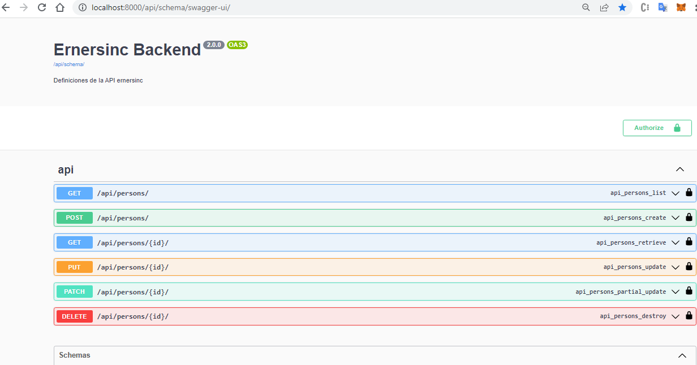

# Prueba Backend
Versión Python: `^3.5`

Versión django: `3.1.7`

#### Configuración del proyecto (Linux/Windows)

git clone https://github.com/Rojas-Andres/challenge_michael_page
cd challenge_michael_page

### Cree virtulenv
    primero instale virtualenv
        pip install virtualenv
    
    crear virtualenv
        virtualenv entorno
    Activar entorno virtual en powershell
        .\entorno\Scripts\activate.ps1 
    Activar entorno virtual en terminal de windows
        .\entorno\Scripts\activate.bat 

### Instale requerimientos

pip3 install -r requeriments.txt

pip install -r requeriments.txt

### Ejecute migraciones:

python manage.py makemigrations

python manage.py migrate

## Correr server

python3 manage.py runserver

python manage.py runserver

## Documentacion de swagger

- Local 
http://localhost:8000/api/schema/swagger-ui/

## Validaciones

- Cuando se elimina un usuario en realidad no se elimina de la base de datos si no que el campo delete_at cambia a la fecha en el cual el usuario se 'elimino' esto porque se hace ? Se realiza porque no es buena practica eliminar usuarios porque imaginemos que tenemos un sistema de e-commerce y un usuario se inscribio a la plataforma , compro muchos productos y luego decidio eliminar la cuenta , si eliminamos el usuario realmente tambiene estariamos eliminando todo el historico de productos que el usuario compro , por lo tanto perderiamos informacion valiosa.

- Si se 'elimina' el usuario el campo documento que es unique , se le agrega deleted_{cantidad} lo que esta entre llaves numero es por si el usuario creo y elimino la cuenta n veces .

- Se añadio en la peticion de tipo get a persons filtros , los cuales son : 
    - document
    - document_type [CÉDULA DE CIUDADANÍA, CÉDULA DE EXTRANJERÍA, PASAPORTE]
    - names
    - last_names

- Se añadio paginador